# Market Pulse: Real-Time Data Pipeline

## Project Overview

This project implements a serverless, distributed data pipeline using Cloud Functions, Pub/Sub, Airflow, and BigQuery to collect and analyze trending information across stocks, news, and public search interest. The goal is to enable real-time insights into what people are talking about, how it's covered in media, and how it impacts the market.

---

### Technologies Used

- **Cloud Functions** for ingestion, transformation, and loading
- **Cloud Pub/Sub** for asynchronous, event-driven messaging
- **Cloud Storage** to store raw and cleaned JSON
- **BigQuery** for structured storage and analysis
- **Cloud Composer (Airflow)** to orchestrate the daily pipeline

---

## Data Pipeline Flow

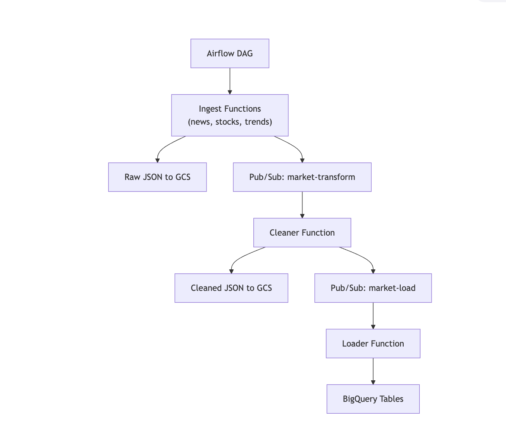

_Figure: Overall data flow from Airflow DAG to BigQuery_

---

### Airflow DAG Execution

At 5:10 PM ET on weekdays, the Airflow DAG uses `PythonOperator` to trigger three ingestion functions in parallel:

- `ingest_news` → Retrieves news articles via NewsAPI
- `ingest_stocks` → Collects daily stock data from Polygon.io
- `ingest_trends` → Fetches trending search topics via SearchAPI.io

Each function writes raw JSON to Cloud Storage and publishes a message to the `market-transform` Pub/Sub topic.

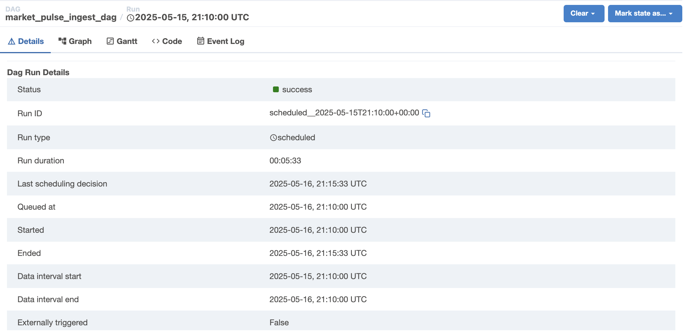

_Figure: DAG successfully ran on May 16, 2025 at 5:10 PM ET._

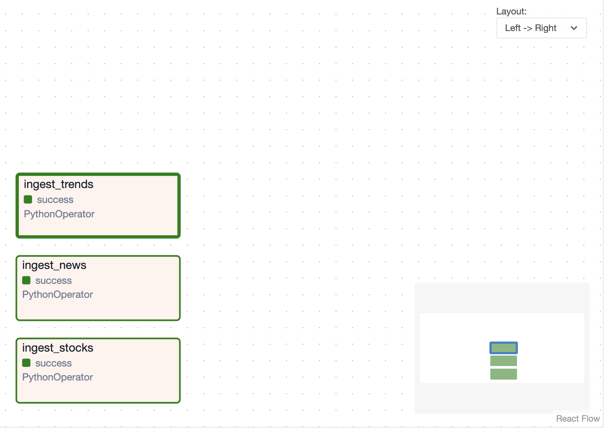

_Figure: All three ingestion tasks completed successfully and triggered downstream processing._

---

### Ingestion Phase

Each ingestion Cloud Function performs the following:

1. Makes a request to its respective API
2. Saves the raw JSON response to a `raw/` folder in **Cloud Storage**
3. Publishes a Pub/Sub message to the `market-transform` topic

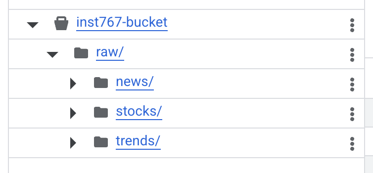

_Figure: Raw data saved to Cloud Storage and message sent to `market-transform` to initiate transformation._

---

### Transformation Phase

The `cleaner` Cloud Function is triggered by messages on the **`market-transform`** topic. It performs the following steps:

1. Reads raw JSON data from GCS
2. Applies cleaning logic (e.g., timestamp formatting, category tagging)
3. Writes newline-delimited cleaned JSON to a `clean/` folder in GCS
4. Publishes a message to the **`market-load`** Pub/Sub topic

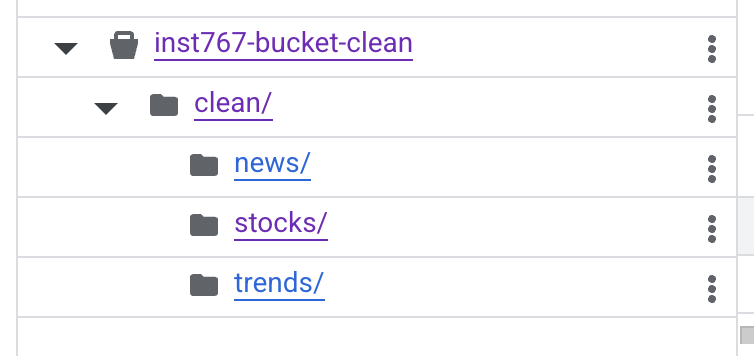

_Figure: Cleaned data written to a new Cloud Storage location and message sent to `market-load`._

---

### BigQuery Load

The `loader` Cloud Function is triggered by messages on the **`market-load`** topic. It loads the cleaned data into three BigQuery tables:

- `stocks_daily`
- `company_news`
- `google_trends`

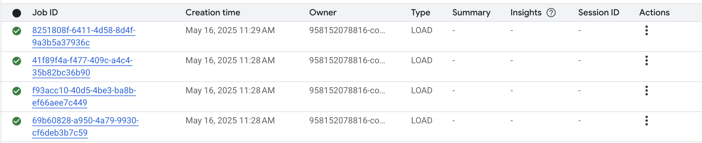

_Figure: Snippet of logs showing cleaned data successfully loaded into BigQuery._

### Cloud Functions Deployment


_Figure: Five Cloud Functions deployed in GCP, enabling modular and distributed execution across pipeline stages._

---

## API Integrations

The ingestion layer of the pipeline uses three public APIs to collect data on daily market activity, media coverage, and public interest. Each API was chosen for its relevance, accessibility, and structured output.

---

### 1. Polygon.io – Stock Market Data

**Endpoint:**  
[`https://api.polygon.io/v2/aggs/ticker/{ticker}/prev`](https://api.polygon.io/v2/aggs/ticker/{ticker}/prev)

**Purpose:**  
Gets daily stock data (Open, High, Low, Close, Volume) for 30 companies. The API usually updates around 4:10 PM, so the pipeline runs an hour later to allow extra time for the data to be available.

**Inputs:**

- `ticker` (string): Stock symbol
- `apiKey` (query param): Polygon.io API key

**Expected Response:**

```json
{
  "ticker": "AAPL",
  "date": "2025-05-15",
  "open": 210.95,
  "high": 212.96,
  "low": 209.54,
  "close": 211.45,
  "volume": 45029473.0
}
```

---

### 2. **NewsAPI – Company News Coverage**

**Endpoint:**  
[`https://newsapi.org/v2/everything`](https://newsapi.org/v2/everything)

**Purpose:**  
Retrieves recent English-language news articles published in the last 24 hours related to the publicly traded companies in the stock list.

**Inputs:**

- `q` (string): Company name
- `from` (date): Starting date for articles (within the past 24 hours)
- `sortBy` (string): `publishedAt`
- `language` (string): `en`
- `apiKey` (query param): NewsAPI key

**Expected Response:**

```json
{
  "company": "Apple",
  "ticker": "AAPL",
  "title": "Ballerina, F1 The Movie, M3GAN 2.0 and Karate Kid Legends all receive their ratings from the MPA",
  "source": "JoBlo.com",
  "published_at": "2025-05-15T13:10:35Z",
  "url": "https://www.joblo.com/mpa-ratings-movies-2025/"
}
```

---

### 3. **SearchAPI.io – Google Trends (Trending Now, U.S.)**

**Endpoint:**  
[`https://www.searchapi.io/api/v1/search`](https://www.searchapi.io/api/v1/search)

**Purpose:**  
Retrieves the top trending search topics in the United States over the past 24 hours.

**Inputs:**

- `engine` (string): `google_trends_trending_now`
- `geo` (string): `US`
- `api_key` (string): SearchAPI.io key

**Expected Response:**

```json
{
  "position": 1,
  "query": "james comey",
  "search_volume": 200000,
  "percentage_increase": 1000,
  "location": "US",
  "categories": ["politics", "law_and_government"],
  "start_date": "2025-05-15T21:10:00Z",
  "end_date": null,
  "time_active_minutes": null,
  "keywords": [
    "james comey",
    "8647",
    "8647 meaning",
    "86 meaning",
    "comey",
    "what does 8647 mean",
    "86 47",
    "86",
    "james comey 8647",
    "comey and trump",
    "what is 8647",
    "james comey tweet",
    "comey 86 47",
    "dailymail",
    "fox news today"
  ]
}
```

---

## BigQuery Tables & Schemas

All cleaned data is loaded into the `daily_intel_dataset` dataset in BigQuery. Each table corresponds to one of the three data sources: stocks, news, and trends.

### Dataset: `daily_intel_dataset`

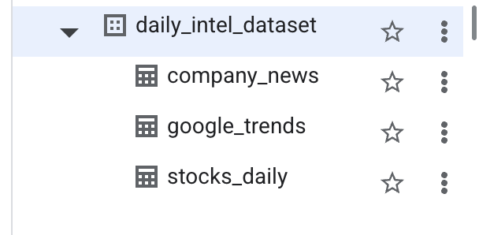

---

#### **Table: `stocks_daily`**

Schema:

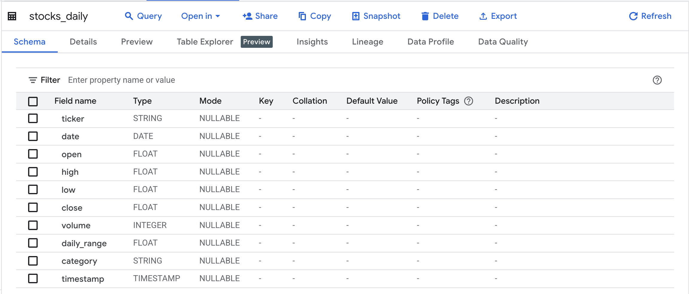

Table preview (showing real data):

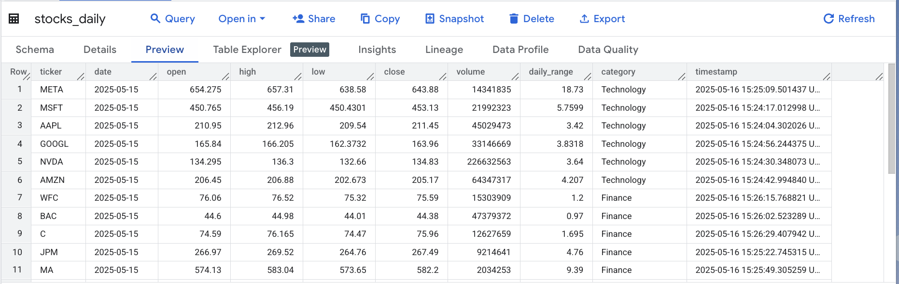

---

#### **Table: `company_news`**

Schema:

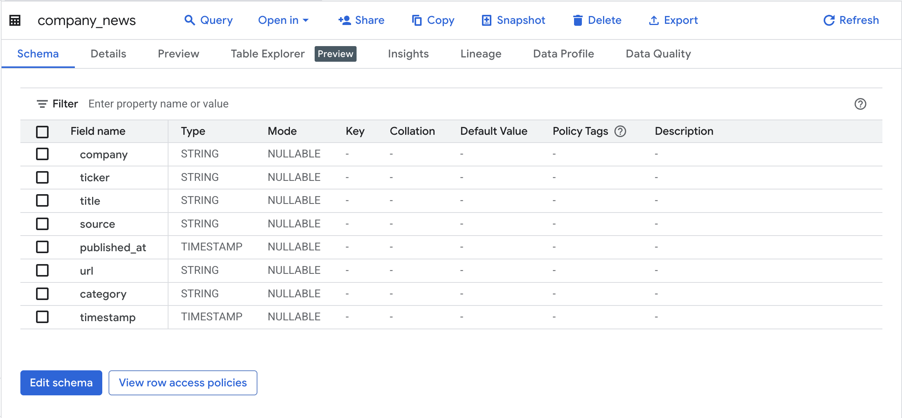

Table preview (showing real data):

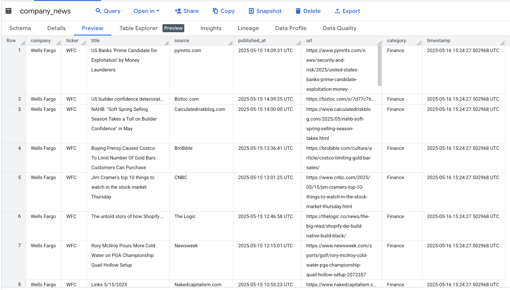

---

#### **Table: `google_trends`**

Schema:

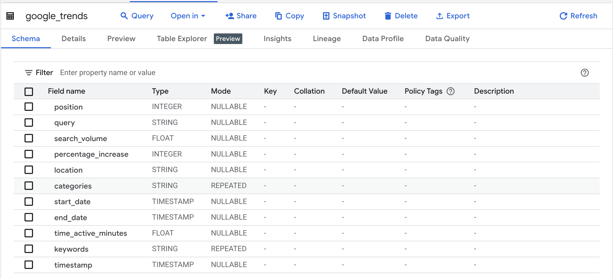

Table preview (showing real data):

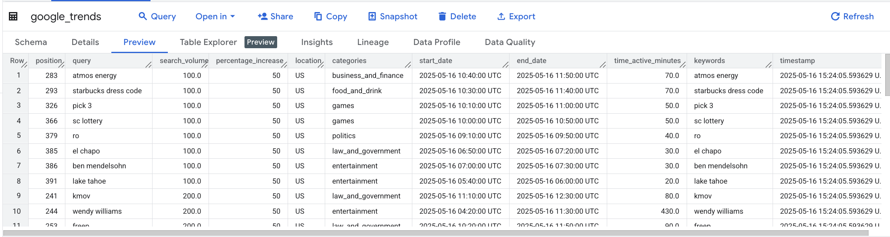

---

## SQL Queries & Insights

Below are five custom SQL queries used to generate insights from the BigQuery tables.

---

### Query 1: Shortest-lived Trending Topic

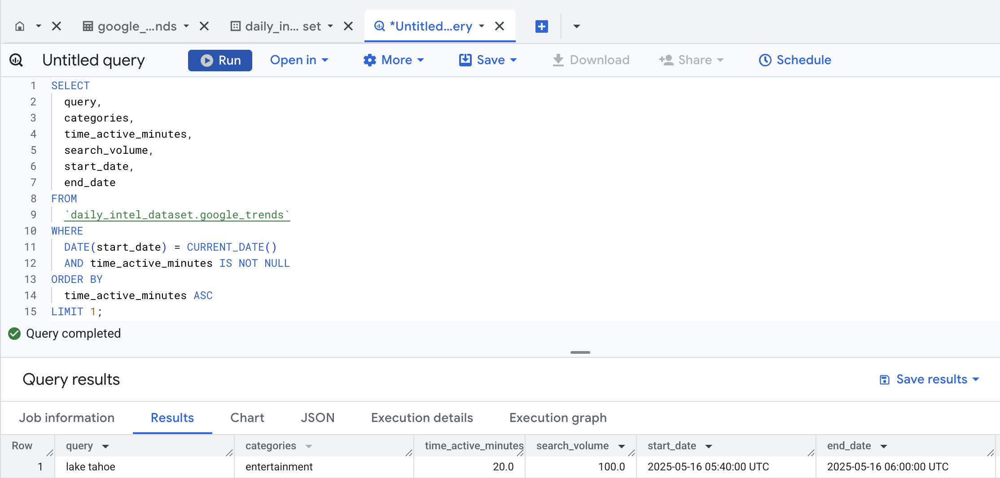

**Purpose:**  
Find the search topic that trended for the shortest amount of time — a quick burst of public interest.

**Output Fields:**

- `query`: The trending search term
- `categories`: Topic categories (e.g., entertainment, politics)
- `time_active_minutes`: How long it stayed trending
- `search_volume`: Estimated popularity
- `start_date`: When it started trending
- `end_date`: When it stopped trending

---

### Query 2: Top News Source by Category

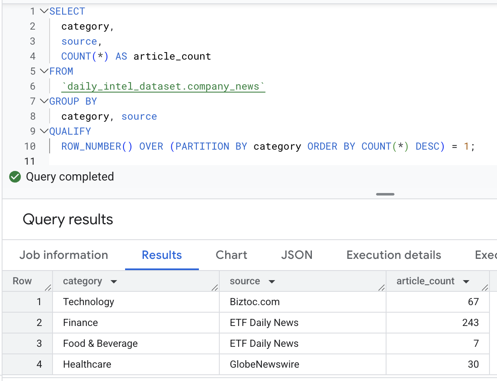

**Purpose:**  
Identify which media source published the most articles in each content category. This helps highlight the most dominant or influential media outlets per sector.

**Output Fields:**

- `category`: News topic
- `source`: Publisher name
- `article_count`: Number of articles published

---

### Query 3: Companies with Most News and Stock Volatility

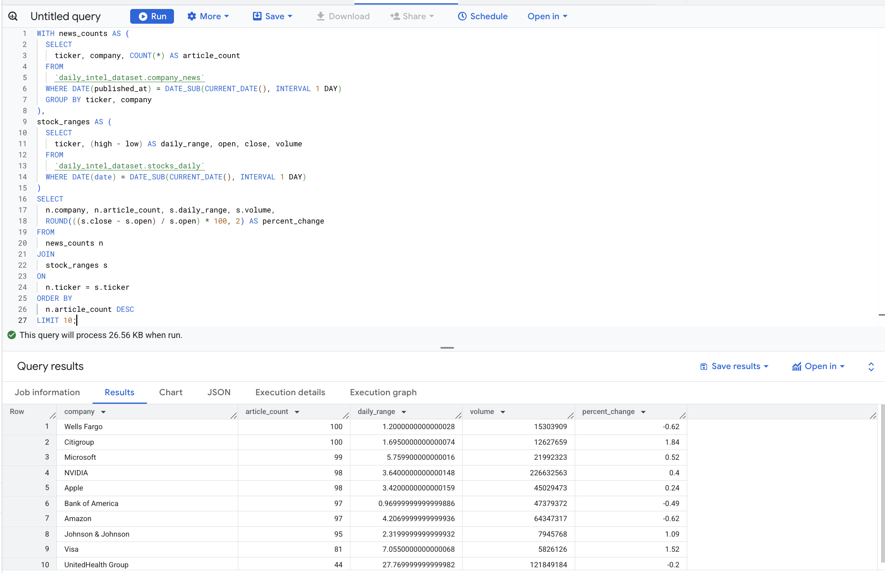

**Purpose:**  
Determine which companies had the most media coverage yesterday, and whether that correlated with stock volatility or price movement.

**Output Fields:**

- `company`: Company name
- `article_count`: Number of news articles
- `daily_range`: How much the stock price fluctuated (high − low)
- `percent_change`: Overall price change from open to close
- `volume`: Total shares traded during the day

---

### Query 4: Media Attention vs. Market Performance by Category

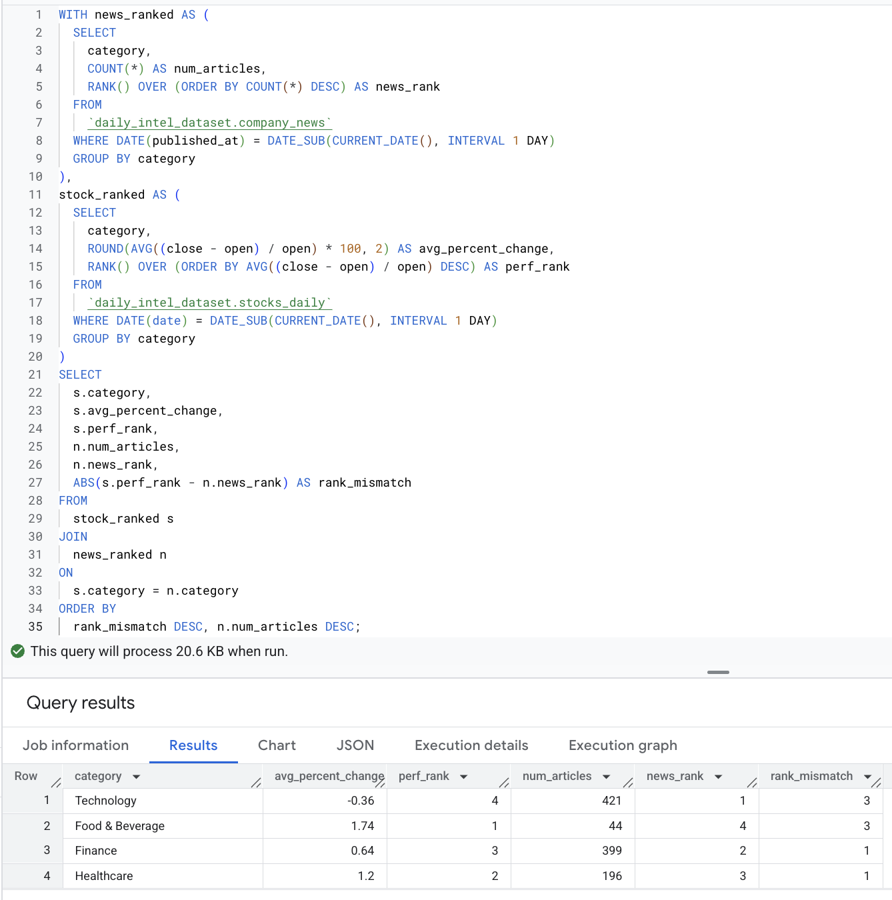

**Purpose:**  
Compare how much media attention each stock category received versus how it actually performed in the market. Highlights misalignments between public/media focus and real market behavior.

**Output Fields:**

- `category`: The stock/news category (e.g., Technology, Healthcare)
- `avg_percent_change`: The average percent change in stock price across the category
- `perf_rank`: Rank of the category by stock performance
- `num_articles`: Number of news articles published in the category
- `news_rank`: Rank of the category by news volume
- `rank_mismatch`: Difference between news rank and performance rank (higher = more misaligned)

---

### Query 5: Trending Search Topics Linked to Market Movement

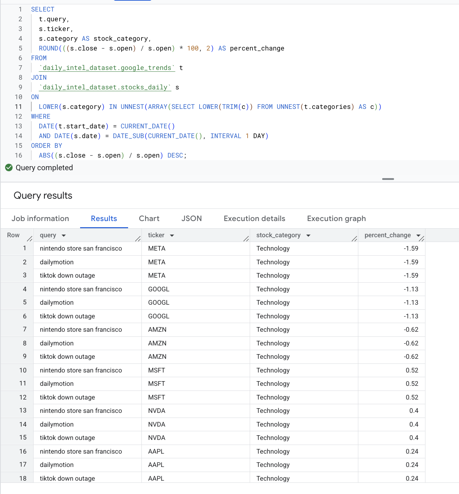

**Purpose:**  
Match trending Google search topics from today with stock categories that had notable price movements yesterday. Helps identify if trending public interest may be connected to recent market activity.

**Output Fields:**

- `query`: The trending search topic
- `ticker`: The stock symbol related to the matched category
- `stock_category`: The stock’s category (e.g., Technology, Finance)
- `percent_change`: The stock’s percent price change from open to close

---

## Local Pipeline Run

Before deploying to GCP, the pipeline was tested locally using scripts in the `local_run/` folder.

- `run_pipeline.py`: Orchestrates the local ingest and transformation process.
- `raw/`: Stores raw API responses in `.json` format.
- `outputs/`: Stores cleaned data in `.csv` format, as required for Issue 3.

[Terminal Demo](local_run/local_run.mp4)

_Figure: Terminal logs showing successful local run._

---

## Folder Structure

The project is organized to separate local testing, cloud functions, SQL, and deployment artifacts.

```bash
.
├── local_run/                    # Local pipeline run (meets Issue 3)
│   ├── ingest_all_local.py       # Ingests data from all 3 APIs
│   ├── transform.py              # Cleans raw JSON and converts to CSV
│   ├── run_pipeline.py           # Orchestrates full local pipeline: ingest → clean
│   ├── raw/                      # Stores raw API JSON responses (pre-cleaning)
│   ├── outputs/                  # Stores cleaned `.csv` files (post-cleaning)
│   └── logs_demo.mp4             # Video demo of terminal run with logs
│
├── src/                          # Cloud Function source code (used in GCP)
│   ├── ingest/                   # Cloud Functions for each data source
│   │   ├── ingest_news.py        # Pulls news articles → saves to GCS → Pub/Sub
│   │   ├── ingest_stocks.py      # Pulls stock OHLCV data → saves to GCS → Pub/Sub
│   │   └── ingest_trends.py      # Pulls trending topics → saves to GCS → Pub/Sub
│   ├── transform/
│   │   └── cleaner.py            # Triggered by `market-transform` topic; cleans raw JSON
│   └── load/
│       └── loader.py             # Triggered by `market-load` topic; loads cleaned JSON to BigQuery
│
├── sql/
│   ├── create_tables.sql         # DDL for BigQuery: defines schemas for all 3 tables
│   └── interesting_queries.sql   # Final analysis queries for insights (Query 1–5)
│
├── screenshots/                  # Visual assets used in the README
├── .env                          # Local env vars for testing (not pushed to GitHub)
├── env.yaml                      # GCP env vars for deploying functions (used with `gcloud`)
├── deploy_functions.sh           # Bash script to deploy all Cloud Functions to GCP
├── run_all.sh                    # Script to run pipeline before Airflow was setup
├── requirements.txt              # Python package dependencies
├── market_pulse_ingest_dag.py    # Airflow DAG definition
└── README.md                     # Project documentation and walkthrough
```

## Author

Meredith Canova
