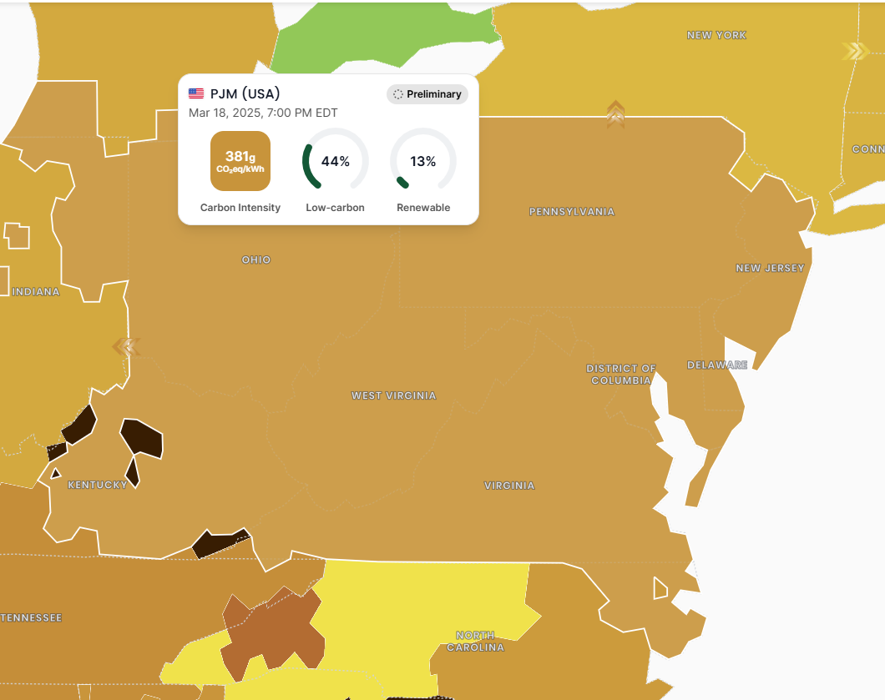

# Sustainability Analytics Pipeline

## Project Overview

My project aims to implement a data pipeline that ingests, transforms, and analyzes sustainability-related data from multiple APIs. The goal is to collect carbon emissions data, electricity production information, and weather patterns. This data can be used in the future to provide insights into environmental impacts and help identify opportunities for reducing carbon footprints.

## Data Sources

The pipeline will utilize the following APIs:

### 1. Carbon Interface API

- Provides carbon emissions data for various activities and energy sources.
- Offers estimates for electricity usage, transportation, and more.
- **Link**: [Carbon Interface](https://www.carboninterface.com/)

### 2. ElectricityMap API

- Shows real-time electricity carbon intensity by region.
- Provides data on energy production sources.
- **Link**: [ElectricityMap](https://www.electricitymaps.com/)

### 3. WeatherBit API

- Detailed weather data including temperature, precipitation, wind.
- Historical and forecast capabilities.
- **Link**: [WeatherBit](https://www.weatherbit.io/)

## Data from API

The free-tier version of the ElectricityMap API allows for data retrieval from only one zone. For this project, the zone **"US-MIDA-PJM"** was selected. This zone covers the states of **District of Columbia, Maryland, Virginia, West Virginia, Pennsylvania, New Jersey, Delaware, Ohio, and Kentucky**.

### Data Types from APIs

#### **Carbon Interface API**

The Carbon Interface API provides estimated carbon emissions for electricity consumption in different states. The key attributes include:

- **electricity_unit**: Measurement unit (e.g., MWh).
- **electricity_value**: The amount of electricity used.
- **carbon_g, carbon_lb, carbon_kg, carbon_mt**: Carbon emissions in grams, pounds, kilograms, and metric tons.
- **estimated_at**: Timestamp of the estimate.

#### **ElectricityMap API**

The ElectricityMap API provides various breakdowns of electricity data, including:

- **Power Consumption Breakdown**: Nuclear, geothermal, biomass, coal, wind, solar, hydro, gas, oil, unknown.
- **Power Production Breakdown**: Similar categories as consumption.
- **Power Import/Export Breakdown**: Tracks electricity flow between regions.
- **Fossil-Free & Renewable Percentage**: Measures the proportion of energy from clean sources.
- **Total Consumption & Production**: Aggregated values for energy usage and generation.
- **Estimation Method**: Indicates how the data is estimated.

#### **WeatherBit API**

The WeatherBit API provides real-time and historical weather data, including:

- **Temperature (temp, app_temp)**: Actual and perceived temperature.
- **Air Quality Index (aqi)**: Measurement of air pollution.
- **Cloud Cover (clouds)**: Percentage of cloud coverage.
- **Dew Point (dewpt)**: Temperature at which condensation forms.
- **Wind (wind_spd, wind_dir, wind_cdir, wind_cdir_full)**: Speed and direction of wind.
- **Precipitation (precip, snow)**: Rain and snow levels.
- **Pressure (pres, slp)**: Atmospheric pressure.
- **Humidity (rh)**: Relative humidity percentage.
- **Solar Radiation (solar_rad, ghi, dhi, dni, elev_angle)**: Measures of solar exposure.
- **Visibility (vis)**: Distance of clear sight.
- **Weather Description (weather.description, weather.code)**: Text and code representation of weather conditions.
- **Time Information (ob_time, datetime, sunrise, sunset, timezone)**: Various timestamps and location data.
