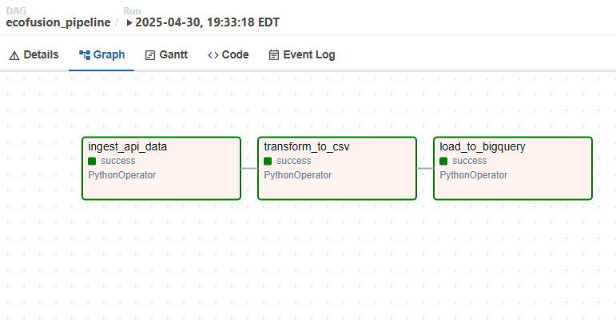

# EcoFusion Data Pipeline

**EcoFusion** is a data pipeline designed to integrate and analyze sustainability-related datasets from three public APIs:

- ⚡ **EIA State Electricity Profile API** (Electric emissions by fuel type)
- 🌿 **Carbon Interface API** (Carbon estimates per MWh of electricity usage)
- 🌦️ **OpenWeatherMap API** (Real-time weather metrics by state capital)

The goal is to produce a unified, queryable dataset in **BigQuery** for analyzing environmental impacts of energy generation, with weather context.

The pipeline is orchestrated using **Cloud Composer (Apache Airflow)**.

## 🌐 API Data Sources

### 1. **EIA API - State Electricity Profile**

- **Endpoint:** `https://api.eia.gov/v2/electricity/state-electricity-profiles/emissions-by-state-by-fuel/data`
- **Returns:**
  - CO2 emissions (thousand metric tons) by state and fuel type (e.g., Coal, Natural Gas)
  - Year (`period`), state abbreviation, fuel description

### 2. **Carbon Interface API - Emission Estimates**

- **Endpoint:** `https://www.carboninterface.com/api/v1/estimates`
- **Returns:**
  - Estimated emissions: grams, pounds, kilograms, metric tons of CO2
  - Includes the electricity value submitted and a timestamp

### 3. **OpenWeatherMap API - Current Weather**

- **Endpoint:** `http://api.openweathermap.org/data/2.5/weather`
- **Returns:**
  - Current temperature, humidity, wind speed/direction, visibility, pressure
  - Main weather type (e.g., Clear, Rain), and cloud cover

## 📁 Project Structure

```
/dag/
├── ecofusion_dag.py          # Airflow DAG definition
├── get_data.py               # Script to ingest data from APIs
├── transform_to_csv.py       # Script to transform JSON data to CSV
├── load_to_bigquery.py       # Script to load CSVs into BigQuery
├── api_results/              # Folder containing raw JSON files (input)
│    ├── carbon_estimates.json
│    ├── weather_data.json
│    └── state_electricity_profile.json
├── data/                     # Folder containing transformed CSVs (output)
│    ├── carbon_emissions.csv
│    ├── weather_snapshot.csv
│    └── state_electricity_emissions.csv
├── schema/
│   └── bigquery_schema.sql     # BigQuery table creation statements
├── queries/
│   └── analysis_queries.sql    # Insightful analysis queries
└── README.md                   # Project overview and instructions
```

## 🌎 BigQuery Dataset Design: `ecofusion`

| Table Name                      | Description                          |
| ------------------------------- | ------------------------------------ |
| `weather_snapshot`              | Weather metrics for each state       |
| `carbon_emissions`              | Carbon emission estimates per state  |
| `state_electricity_emissions`   | CO2 emissions by fuel type per state |
| `state_emission_summary` (VIEW) | Aggregated emissions per state/year  |

### Table: `weather_snapshot`

| Column Name         | Data Type | Description                                |
| ------------------- | --------- | ------------------------------------------ |
| state               | STRING    | US state abbreviation                      |
| city                | STRING    | State capital or representative city       |
| datetime            | TIMESTAMP | Datetime of the weather snapshot           |
| temp_celsius        | FLOAT64   | Current temperature in Celsius             |
| feels_like_celsius  | FLOAT64   | Perceived temperature in Celsius           |
| humidity_percent    | INT64     | Humidity percentage                        |
| pressure_hpa        | INT64     | Atmospheric pressure in hPa                |
| weather_main        | STRING    | Main weather condition (e.g., Clear, Rain) |
| weather_description | STRING    | Detailed weather description               |
| wind_speed_mps      | FLOAT64   | Wind speed in meters per second            |
| wind_deg            | INT64     | Wind direction in degrees                  |
| cloud_percent       | INT64     | Cloudiness percentage                      |
| visibility_m        | INT64     | Visibility in meters                       |

### Table: `carbon_emissions`

| Column Name           | Data Type | Description                       |
| --------------------- | --------- | --------------------------------- |
| state                 | STRING    | US state abbreviation             |
| country               | STRING    | Country code (typically 'US')     |
| estimated_at          | TIMESTAMP | Time of the estimate              |
| electricity_value_mwh | FLOAT64   | Amount of electricity used in MWh |
| carbon_g              | INT64     | Carbon emitted in grams           |
| carbon_lb             | FLOAT64   | Carbon emitted in pounds          |
| carbon_kg             | FLOAT64   | Carbon emitted in kilograms       |
| carbon_mt             | FLOAT64   | Carbon emitted in metric tons     |

### Table: `state_electricity_emissions`

| Column Name      | Data Type | Description                           |
| ---------------- | --------- | ------------------------------------- |
| state            | STRING    | US state abbreviation                 |
| year             | INT64     | Reporting year                        |
| fuel_type        | STRING    | Fuel ID code (e.g., COL, NG, PET)     |
| fuel_description | STRING    | Full description of the fuel          |
| co2_thousand_mt  | FLOAT64   | CO2 emissions in thousand metric tons |

### View: `state_emission_summary`

| Column Name         | Data Type | Description                           |
| ------------------- | --------- | ------------------------------------- |
| state               | STRING    | US state abbreviation                 |
| year                | INT64     | Reporting year                        |
| coal_emissions      | FLOAT64   | Emissions from coal                   |
| gas_emissions       | FLOAT64   | Emissions from natural gas            |
| petroleum_emissions | FLOAT64   | Emissions from petroleum              |
| other_emissions     | FLOAT64   | Emissions from other sources          |
| total_emissions     | FLOAT64   | Total emissions across all fuel types |

## 🔍 Interesting Analytical Queries

### 1. Do hotter states emit less carbon per MWh on average? 🌡️

```sql
SELECT
  w.state,
  AVG(w.temp_celsius) AS avg_temp,
  AVG(c.carbon_kg / c.electricity_value_mwh) AS kg_per_mwh
FROM `ecofusion.weather_snapshot` w
JOIN `ecofusion.carbon_emissions` c ON LOWER(w.state) = LOWER(c.state)
GROUP BY w.state
ORDER BY kg_per_mwh DESC;
```

### 2. Are clear sky days associated with lower emissions per state? ☀️

```sql
SELECT
  w.state,
  COUNTIF(w.weather_main = 'Clear') AS clear_days,
  AVG(c.carbon_kg) AS avg_emission_all_days,
  AVG(CASE WHEN w.weather_main = 'Clear' THEN c.carbon_kg END) AS avg_emission_clear_days
FROM `ecofusion.weather_snapshot` w
JOIN `ecofusion.carbon_emissions` c ON LOWER(w.state) = LOWER(c.state)
GROUP BY w.state
ORDER BY avg_emission_clear_days;
```

More interesting queries are included in [`queries/analysis_queries.sql`](queries/analysis_queries.sql).

## 🚀 Pipeline Workflow

1. **Ingest Stage** (Run Locally)

   - `get_data.py` pulls latest data from APIs and saves JSONs into `/api_results/`.
   - Runs inside GCP via Airflow PythonOperator task (ingest_api_data).

2. **Transform Stage**

   - `transform_to_csv.py` reads JSONs from `/api_results/`
   - Converts them into structured CSVs saved in `/data/`

3. **Load Stage**

   - `load_to_bigquery.py` loads the CSVs into BigQuery tables inside the `ecofusion` dataset.

4. **Orchestration**
   - The entire process is automated via `ecofusion_pipeline` Airflow DAG running inside Cloud Composer.

## 📅 Deployment Environment

- **Orchestration:** Cloud Composer (Apache Airflow 2.7+)
- **Compute:** GKE (Google Kubernetes Engine, managed by Composer)
- **Storage:** Google Cloud Storage (DAGs, data files)
- **Analytics Warehouse:** BigQuery

## 📊 DAG Flow Diagram



This diagram shows the Airflow DAG structure:

- Ingest Task pulls from APIs
- Transform Task converts to CSV
- Load Task pushes to BigQuery

## 📋 Success Checklist

| Step                            | Status |
| ------------------------------- | ------ |
| Airflow DAG operational         | ✅     |
| Data ingestion complete         | ✅     |
| Data transformation working     | ✅     |
| CSV to BigQuery load successful | ✅     |
| BigQuery dataset verified       | ✅     |
