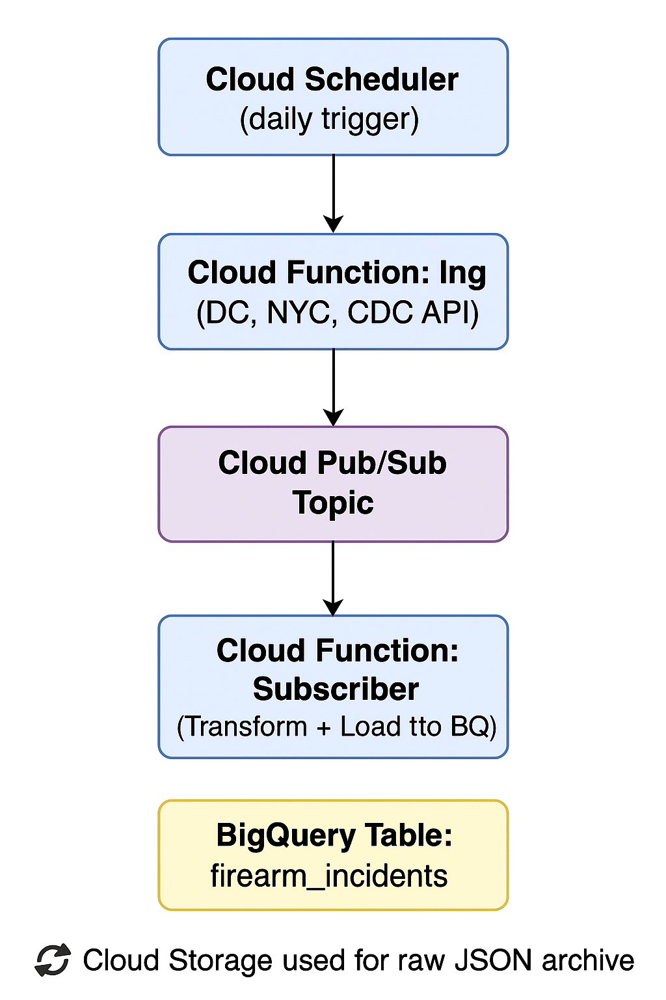

# Gun Violence Data Integration Project

## Overview

This project focuses on building an end-to-end data pipeline using **Google Cloud Platform (GCP)** to process and analyze gun violence–related data from U.S. cities — **Washington D.C.**, **New York City**, and **state-level mortality data** from the **CDC**.

The primary goal is to study firearm-related trends across city and state levels by integrating data from multiple public APIs. The pipeline is designed for automation, modularity, and real-time scalability using cloud-native tools. Cleaned and transformed data is loaded into **BigQuery**. This enables near-real-time analysis of firearm violence trends by location, time, and intent.

---

## API Data Sources

Below are the three public APIs selected for this project. These APIs offer incident-level gun violence data and are updated regularly.

---

### 1. **Washington, D.C. Gun Violence Data**
- **API Type:** ArcGIS REST (GeoJSON)
- **Endpoint:**  
  [https://opendata.arcgis.com/datasets/89bfd2aed9a142249225a638448a5276_29.geojson](https://opendata.arcgis.com/datasets/89bfd2aed9a142249225a638448a5276_29.geojson)
- **Inputs:** None (full GeoJSON can be fetched directly)
- **Expected Data Fields:**
  - `offense` (e.g., Assault w/ Gun)
  - `method` (e.g., firearm)
  - `block_group`, `neighborhood_cluster`
  - `report_date`, `clearance_date`
  - `latitude`, `longitude`

### 2. **CDC Firearm Mortality by State **

- **Endpoint:**  
  [`https://data.cdc.gov/resource/fpsi-y8tj.json`](https://data.cdc.gov/resource/fpsi-y8tj.json)

- **Inputs:**  
  - `$where`: `intent LIKE 'FA_%'`  
    *(Filters for firearm-related categories such as `FA_Suicide`, `FA_Homicide`, and `FA_Deaths`)*
  - `$limit`: `1000` *(Adjustable based on volume needs)*

- **Expected Fields:**  
  - `name`: Name of the U.S. state  
  - `geoid`: State-level geographic FIPS code  
  - `intent`: Firearm-specific cause of death (e.g., `FA_Homicide`)  
  - `period`: Reporting year (used for `incident_date`)  
  - `count_sup`: Whether values were suppressed (`true/false`)  
  - `rate`: Crude mortality rate  
  - `date_as_of`: Last update timestamp from the CDC  
  - `ttm_date_range`: Trailing 12-month reporting window

### 3. **NYPD Complaint Data (New York City)**
- **API Type:** Socrata Open Data API (SODA)
- **Endpoint:**  
  [https://data.cityofnewyork.us/resource/5uac-w243.json](https://data.cityofnewyork.us/resource/5uac-w243.json)
- **Inputs:**
  - `$where`: `pd_desc LIKE '%FIREARM%'`
  - `$limit`: 1000
- **Expected Data Fields:**
  - `cmplnt_fr_dt`, `boro_nm`, `law_cat_cd`
  - `ofns_desc`, `pd_desc` (includes firearm type)
  - `latitude`, `longitude`, `juris_desc`

---

## Analytical Questions
- Which neighborhoods in D.C. and boroughs in NYC report the most firearm-related incidents?
- How have firearm-related incidents trended over the past 12 months in each city?
- How do firearm-related injury rates vary across states, according to the CDC?
- Is there any correlation between urban gun violence (DC/NYC) and state-level firearm death rates (CDC)?

---
## Key Features
- **Automated Ingestion** from three public APIs (DC, NYC, CDC)
- **Google Cloud Functions (2nd Gen)** for serverless deployment
- **Asynchronous Message Passing** using **Cloud Pub/Sub**
- **Scheduled Runs** with **Cloud Scheduler** (Daily at 6 AM EST)
- **Intermediate Storage** in **Google Cloud Storage (GCS)**
- **Structured Transformation** with pandas
- **Data Warehouse Integration** with **BigQuery**
- **Logging** throughout for monitoring and debugging

---
## Architecture Overview

--- 
## Tool Stack

| Layer            | Technology                        | Purpose                                      |
|------------------|-----------------------------------|----------------------------------------------|
| **Ingest**       | Python + Requests                 | Fetch API data (DC, NYC, CDC)                |
| **Transform**    | Pandas                            | Clean and unify schema                       |
| **Cloud Storage**| Google Cloud Storage (GCS)        | Store raw and processed files                |
| **Messaging**    | Cloud Pub/Sub                     | Asynchronous data transfer (Ingest → Transform) |
| **Compute**      | Cloud Functions                   | Event-driven execution of ETL steps          |
| **Scheduler**    | Cloud Scheduler                   | Automate daily ingestion                     |
| **Data Warehouse** | BigQuery                        | Centralized storage for analytics            |
| **Logging**      | Cloud Logging                     | Monitor ETL health & failures                |

---

## Deployment & Scheduling
### Cloud Functions (2nd Gen)
- Functions:
- - run-ingest-pubsub (Ingest & publish)
- - run-transform-subscriber (Transform & load)
- - local_pipeline.py (for local testing)

### Cloud Scheduler
- Name: gun-violence-daily-job
- Schedule: Daily at 6 AM (Eastern Time)

### GCS Bucket
- Name: gv-etl-bucket
- Folder: ingest/ stores raw JSON data

---

## Logging & Monitoring
- Python logging module used throughout all functions
- Logs viewable in Cloud Logging
- Logs capture API request status, transformation size, and BigQuery load status

---
## Sample Analytical Query
**Monthly firearm incident trend per city (2020-2024)**

SELECT city, location, total_incidents FROM (
  SELECT city, location, COUNT(*) AS total_incidents,
  ROW_NUMBER() OVER (PARTITION BY city ORDER BY COUNT(*) DESC) AS rn
  FROM `gv-etl-spring.gun_violence_dataset.firearm_incidents`
  WHERE city IS NOT NULL AND location IS NOT NULL
  GROUP BY city, location
)
WHERE rn <= 5;

- This query helps identify trends and spikes in gun violence patterns, useful for policy planning and community outreach.

---

## Data Modelling decisions:
**Note on Missing Location Fields**

The CDC dataset provides state-level firearm mortality rates and does not include granular data like city, latitude, or longitude. To maintain a consistent schema across all sources (DC, NYC, and CDC), these fields are retained in the unified table but left null for CDC records. This approach simplifies downstream queries and maintains flexibility for comparative analyses.

## Geolocation Columns: Why Latitude & Longitude columns were retained
Although the current set of analytical queries does not use`latitude` and `longitude`, I chose to retain these fields in the BigQuery schema for the following reasons:

### Future Expandability
Including geolocation data allows for:
- Heatmap generation of firearm incidents
- Integration with GIS tools like Looker Studio, Tableau, or QGIS
- Proximity analysis (e.g., incidents near schools or public spaces)
- Building geofenced alerts or regional summaries

### Schema Uniformity Across Data Sources
The unified dataset combines records from:
- Washington, D.C. ArcGIS (GeoJSON)
- NYC Open Data (Socrata API)
- CDC State-Level Data (SODA API)

Even though CDC data lacks lat/long, having these fields ensures **consistent schema design**, making it easier to process, transform, and load all data into a single table.

### Geospatial Filtering Potential
In future stages, the pipeline could evolve to support:
- Bounding box queries
- Geohash clustering
- Reverse geocoding for labeling regions
Having lat/long now avoids restructuring the pipeline later.

---

## IAM Roles Used in the Project

To ensure security and grant the least privilege required for each component to function, we assigned the following IAM roles:

| Service              | IAM Role                         | Purpose |
|----------------------|----------------------------------|---------|
| Cloud Storage (GCS)  | `roles/storage.objectAdmin`     | Upload raw data files (JSON/CSV) to GCS |
| BigQuery             | `roles/bigquery.dataEditor`     | Load transformed data into BigQuery tables |
| BigQuery             | `roles/bigquery.user`           | Run SQL queries and manage jobs |
| Cloud Functions      | `roles/cloudfunctions.invoker`  | Allow HTTP requests from Scheduler or browser to trigger functions |

All service accounts were limited to specific permissions necessary for the ingest, transform, and load phases of the pipeline.

---
Developed by **Twinkle Rathod**
University of Maryland
INST767 Big Data - Spring 2025
