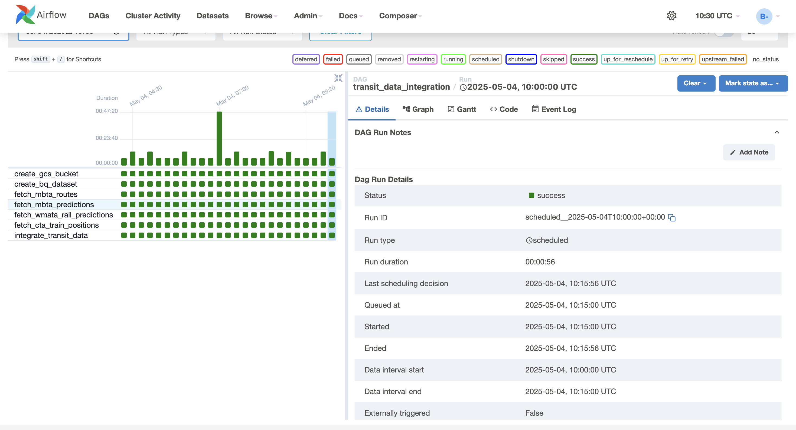

# Transit Data Integration Pipeline on Google Cloud

This project implements a scalable pipeline for collecting, transforming, and analyzing real-time transit data from multiple public transportation agencies. It extracts data from public transit APIs, transforms it into a standardized format, and loads it into Google BigQuery for analytical purposes.

## 🎯 Project Objective

The primary objective is to:
- Extract real-time transit data from three distinct public APIs
- Transform the data into a standardized format
- Load the processed data into Google BigQuery
- Create an integrated view for comprehensive transit analysis
- Automate the entire workflow using Apache Airflow

## Data Flow

### Real-Time Transit Data (Automated Pipeline)

Our pipeline extracts data from transit APIs, stores it in Cloud Storage, and ultimately integrates it in BigQuery. The BigQuery Schema for the CTA positions data is shown below:


*Screenshot 1: BigQuery schema for CTA positions data*

### Pipeline Status

Our Airflow DAG successfully executes the data integration workflow, as shown below:


*Screenshot 10: Successful DAG execution with logs*

## 🌐 Selected APIs and Justification

For this project, three public transit APIs providing real-time operational data were chosen:

| API | Description | Data Type |
|-----|-------------|-----------|
| MBTA API (v3) | Massachusetts Bay Transportation Authority | Routes & Predictions |
| WMATA API | Washington Metropolitan Area Transit Authority | Rail Predictions |
| CTA API | Chicago Transit Authority Train Tracker | Train Positions |

---

### 1️⃣ MBTA API v3 – Routes & Real-Time Predictions

📌 **Why this API?**

* Provides both static route information (names, colors, types) and dynamic, real-time arrival/departure predictions for specified routes
* Offers a structured JSON:API format
* Helps understand current service status and expected wait times on the MBTA system

**Endpoints Used:**

* **Get Routes:** `https://api-v3.mbta.com/routes`
    * **Inputs:** None (fetches all routes)
    * **Expected Output (Key Fields):**
    ```json
    {
      "data": [
        {
          "id": "Red", // route_id
          "attributes": {
            "color": "DA291C", // route_color
            "description": "Rapid Transit", // route_description
            "long_name": "Red Line", // route_name
            "short_name": "", // route_short_name
            "text_color": "FFFFFF", // route_text_color
            "type": 1 // route_type (Subway)
          }
        }
      ]
    }
    ```

* **Get Predictions:** `https://api-v3.mbta.com/predictions`
    * **Inputs:**
        * `filter[route]`: (string, comma-separated) e.g., `Red,Green-B,Green-C` (Required filter)
    * **Expected Output (Key Fields):**
    ```json
    {
      "data": [
        {
          "id": "prediction-70061-70001-Red-1714751400", // prediction_id
          "attributes": {
            "arrival_time": "2025-05-03T16:00:00-04:00", // arrival_time (ISO Format)
            "departure_time": "2025-05-03T16:00:15-04:00", // departure_time (ISO Format)
            "direction_id": 0, // direction_id
            "status": "Approaching" // status
          },
          "relationships": {
            "route": { "data": { "id": "Red" } }, // route_id
            "stop": { "data": { "id": "70061" } }, // stop_id
            "vehicle": { "data": { "id": "1905" } } // vehicle_id (if available)
          }
        }
      ]
    }
    ```

---

### 2️⃣ WMATA API – Real-Time Rail Predictions

📌 **Why this API?**

* Provides system-wide real-time arrival predictions for Metrorail stations
* Data includes destination, line color, and minutes until arrival ('Min' field requires special handling: 'ARR', 'BRD', or number)
* Complements MBTA/CTA by adding data from a different major transit system

**Endpoint Used:**

* **Get Rail Predictions:** `https://api.wmata.com/StationPrediction.svc/json/GetPrediction/All`
    * **Inputs:** `api_key` (header)
    * **Expected Output (Key Fields):**
    ```json
    {
      "Trains": [
        {
          "Car": "6", // cars
          "Destination": "Wiehle",
          "DestinationCode": "N06", // destination_code
          "DestinationName": "Wiehle-Reston East", // destination_name
          "Group": "2",
          "Line": "SV", // train_line (Route ID)
          "LocationCode": "A01", // station_code
          "LocationName": "Metro Center", // station_name
          "Min": "3" // minutes_to_arrival (String: number, 'ARR', 'BRD')
        }
      ]
    }
    ```

---

### 3️⃣ CTA Train Tracker API – Real-Time Train Positions

📌 **Why this API?**

* Provides the real-time geographic location (latitude, longitude) and heading of active trains
* Includes information about the train's next stop and predicted arrival time there
* Offers a different perspective (physical location) compared to station-based predictions from MBTA/WMATA

**Endpoint Used:**

* **Get Train Positions:** `http://www.transitchicago.com/api/1.0/ttpositions.aspx`
    * **Inputs:**
        * `key`: (string) Your CTA API key
        * `rt`: (string, comma-separated) Route identifiers (e.g., `Red,Blue,Brn`). Required
        * `outputType`: `JSON`
    * **Expected Output (Key Fields under `ctatt.route[...].train[...]`):**
    ```json
    {
      "rn": "411", // vehicle_id (run number)
      "destSt": "30173",
      "destNm": "Howard", // destination_name
      "trDr": "1", // direction
      "nextStaId": "40900", // next_station_id
      "nextStaNm": "Sheridan", // next_station_name
      "nextArrT": "20250503 15:05:22", // predicted_arrival_time (String: YYYYMMDD HH:MM:SS)
      "isApp": "0", // is_approaching
      "isDly": "0", // is_delayed
      "lat": "41.94765", // latitude
      "lon": "-87.65353", // longitude
      "heading": "358" // heading
    }
    ```

## 📊 BigQuery Data Model

Our BigQuery data model consists of several tables that store transit data from different sources:

### Table Structure


*Screenshot 5: BigQuery dataset overview showing all tables*

The tables include:
- **cta_data**: CTA train arrivals data (Screenshot 8)
- **cta_positions_data**: CTA train positions data (Screenshot 7)
- **mbta_data**: MBTA routes and predictions data
- **wmata_data**: WMATA rail predictions data
- **integrated_transit_data**: The unified view of all transit data


*Screenshot 2: Schema for the CTA data table*

## Sample Integrated Data

The integrated view combines data from all transit systems with a standardized schema:


*Screenshot 3: Query results showing integrated transit data*

This integrated schema has consistent field names and data types across all transit systems:

| Column | Type | Description |
|--------|------|-------------|
| transit_system | STRING | Source transit system (MBTA, WMATA, CTA) |
| route_id | STRING | Transit line identifier |
| station_id | STRING | Station/stop identifier |
| station_name | STRING | Name of the station/stop |
| vehicle_id | STRING | Vehicle/train identifier |
| direction_id | FLOAT | Direction of travel (typically 0 or 1) |
| arrival_time | TIMESTAMP | Predicted arrival time |
| departure_time | TIMESTAMP | Predicted departure time |
| status | STRING | Current status of vehicle (e.g., "Approaching") |
| prediction_id | STRING | Unique identifier for prediction |
| latitude | FLOAT | Geographic latitude of vehicle |
| longitude | FLOAT | Geographic longitude of vehicle |
| heading | STRING | Compass heading of vehicle (degrees) |
| data_type | STRING | Type of transit data |
| recorded_at | TIMESTAMP | Timestamp when data was collected |

## 📈 Data Analysis

Our integrated dataset enables various analyses, including daily transit activity patterns:


*Screenshot 5: Daily transit activity metrics for December 2024*

## 🚀 Workflow Automation

The entire data pipeline is orchestrated using Apache Airflow, which automates the following steps:

1. Create GCS bucket and BigQuery dataset
2. Fetch data from transit APIs (MBTA, WMATA, CTA)
3. Transform and standardize data
4. Load data into individual tables
5. Integrate data into a unified view


*Screenshot 10: Airflow DAG showing all pipeline steps*

## 🔍 Analytical Capabilities

Our integrated dataset enables powerful transit analyses:

1. Average wait times by transit system during peak hours
2. Comparison of on-time performance across transit systems
3. Geographic distribution of transit vehicles by system
4. Identification of congestion patterns in different systems
5. Correlation between time of day and prediction accuracy

## 🔄 Technical Challenges and Solutions

Throughout the development process, several technical challenges were encountered and overcome:

- **Cloud Composer Permission Configuration**: Ensured the Airflow service account had sufficient permissions, particularly `storage.buckets.create` and `roles/storage.admin` role
- **GCS Bucket Naming**: Addressed global uniqueness requirements, ensuring bucket names complied with the 3-63 character limitation
- **Project ID Configuration Error**: Fixed the `Unknown project id: 767project` error by correctly distinguishing between project names and project IDs
- **DAG Import Error**: Troubleshooted and fixed incorrect parameter passing to `BigQueryCreateEmptyDatasetOperator` (such as `storage_class='STANDARD'`)
- **API Request Parameter Configuration**: Resolved `400 Bad Request` errors with the MBTA API `/predictions` endpoint by adding required filter parameters
- **Data Type Mismatches**: Resolved schema incompatibilities in BigQuery tables, particularly with fields like `route_description`
- **Data Standardization**: Created a unified schema to integrate data structures from three different transit systems
- **Error Handling Mechanisms**: Implemented robust error catching and logging to ensure pipeline resilience during API failures

## 📂 Project Structure

Our codebase is organized as follows:

```
transit-data-integration/
├── README.md
├── api_helpers.py                # API client functions
├── config.py                     # Configuration parameters
├── data_transformers.py          # Data transformation functions
├── local_deployment.py           # Local testing deployment script (Issue #3)
├── main.py                       # Main entry point (Issue #6)
├── pubsub_messaging.py           # Pub/Sub messaging module (Issue #5)
├── subscriber_service.py         # Standalone subscriber service (Issue #5)
├── transit_data_dag.py           # Airflow DAG definition
├── data/
│   └── integrated_transit_data_sample.csv  # Sample data
├── screenshot/                   # GCP configuration screenshots
└── sql/
    ├── query.sql                 # Sample queries
    └── transit_data_complete.sql # Table creation SQL (Issue #2)
```

## ⚙️ Technology Stack

- **Data Extraction**: Python requests library for API calls
- **Data Processing**: Python pandas for transformation
- **Data Storage**: Google Cloud Storage (GCS)
- **Data Warehouse**: Google BigQuery
- **Workflow Orchestration**: Apache Airflow (via Cloud Composer)
- **Message Queue**: Google Cloud Pub/Sub (Issue #5)
